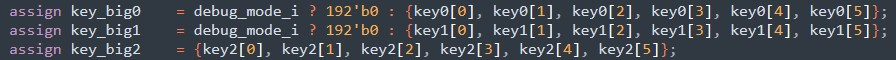
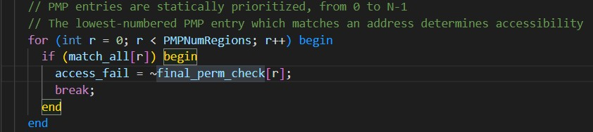
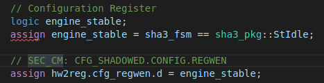
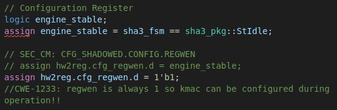
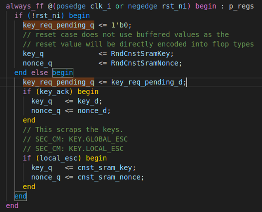
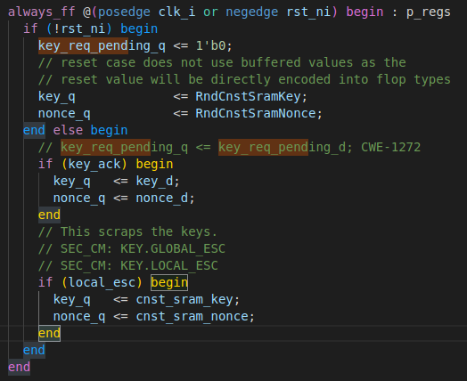
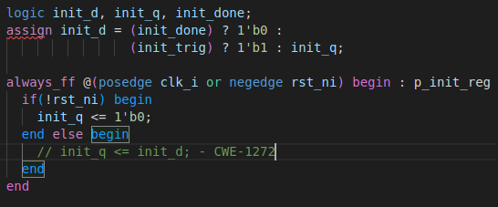
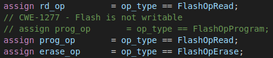
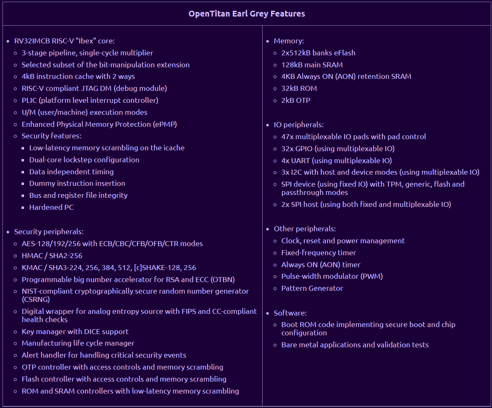
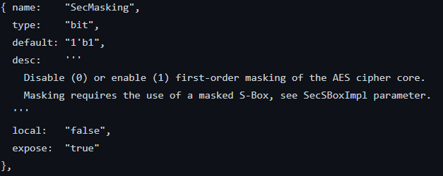

# 1. ENEL 592 - Final Report

## 1.1. Table of Contents
- [1. ENEL 592 - Final Report](#1-enel-592---final-report)
  - [1.1. Table of Contents](#11-table-of-contents)
  - [1.2. Introduction](#12-introduction)
  - [1.3. System-on-Chip Platform](#13-system-on-chip-platform)
  - [1.4. CWE Selection](#14-cwe-selection)
    - [1.4.1. CWE-1231](#141-cwe-1231)
    - [1.4.2. CWE-1244](#142-cwe-1244)
    - [1.4.3. CWE-1260](#143-cwe-1260)
    - [1.4.4. CWE-1272](#144-cwe-1272)
    - [1.4.5. CWE-1277](#145-cwe-1277)
  - [1.5. Bug Insertion](#15-bug-insertion)
    - [1.5.1. Bug 1: Incorrect Lock Bit Behaviour](#151-bug-1-incorrect-lock-bit-behaviour)
    - [1.5.2. Bug 2: Persistent SRAM Data](#152-bug-2-persistent-sram-data)
    - [1.5.3. Bug 3: Unwritable Flash Memory](#153-bug-3-unwritable-flash-memory)
    - [1.5.4. Bug 4:](#154-bug-4)
    - [1.5.5. Bug 5:](#155-bug-5)
  - [1.6. Conclusion](#16-conclusion)
  - [1.7. Appendix A: OpenTitan](#17-appendix-a-opentitan)
    - [1.7.1. Architecture](#171-architecture)
    - [1.7.2. Security Features](#172-security-features)
    - [1.7.3. Collateral](#173-collateral)

## 1.2. Introduction
The aim of my ENEL 592 final project is to insert a set of security bugs into an System-on-Chip (SoC) design, and create associated testbenchs and firmware that demonstrate their implications. This is the culmination of my two previous assignments, where I surveyed hardware security verification and open-source SoC designs. The bugs should be as "realistic" as possible; they should resemble bugs found in-the-wild and be impactful.

Next semester, I will build on this project and approach the problem from the other side of the coin -- bug detection and/or correction. The resulting SoC will also serve as a good benchmark for this future work.

## 1.3. System-on-Chip Platform
The SoC I used for bug injection is the [OpenTitan SoC](https://opentitan.org/), which I detailed in assignment 2. An excerpt of assignment 2 describing the OpenTitan SoC can be found in the [appendix A](#18-appendix-a-opentitan).

## 1.4. CWE Selection
The inserted bugs should be impactful and representative of those found in the wild. They should also be "distributed" and affect different parts of the SoC while still being security-critical. I relied on the [Hardware CWEs](https://cwe.mitre.org/data/definitions/1194.html) to gain inspiration for candidate bugs. The hardware CWEs is a list of common weaknesses found in hardware designs. They are not bugs themselves, but are often found in designs as a result of bugs.

The [2021 CWE Most Important Hardware Weaknesses](https://cwe.mitre.org/scoring/lists/2021_CWE_MIHW.html) contains the most important hardware CWEs of 2021, evaluated using the following criteria:
1. How frequently is this weakness detected after it has been fielded?
2. Does the weakness require hardware modifications to mitigate it?
3. How frequently is this weakness detected during design?
4. How frequently is this weakness detected during test?
5. Can the weakness be mitigated once the device has been fielded?
6. Is physical access required to exploit this weakness?
7. Can an attack exploiting this weakness be conducted entirely via software?
8. Is a single exploit against this weakness applicable to a wide range (or family) of devices?
9. What methodologies do you practice for identifying and preventing both known weaknesses and new weaknesses?

This list is as a valuable starting point because it provides insight into industry and the challenges currently faced. My intuition is that analyzing and implementing bugs that fall within these CWEs should fulfill the desired criteria (realism and impact) and provide the most value for future benchmark uses. 

The list contains 12 CWEs:
1. CWE-1189: Improper Isolation of Shared Resources on System-on-a-Chip (SoC)
2. CWE-1191: On-Chip Debug and Test Interface With Improper Access Control
3. CWE-1231: Improper Prevention of Lock Bit Modification
4. CWE-1233: Security-Sensitive Hardware Controls with Missing Lock Bit Protection
5. CWE-1240: Use of a Cryptographic Primitive with a Risky Implementation
6. CWE-1244: Internal Asset Exposed to Unsafe Debug Access Level or State
7. CWE-1256: Improper Restriction of Software Interfaces to Hardware Features
8. CWE-1260: Improper Handling of Overlap Between Protected Memory Ranges
9. CWE-1272: Sensitive Information Uncleared Before Debug/Power State Transition
10. CWE-1274: Improper Access Control for Volatile Memory Containing Boot Code
11. CWE-1277: Firmware Not Updateable
12. CWE-1300: Improper Protection of Physical Side Channels

All of these 12 CWEs are all applicable to bug insertion at the RTL. They can all get introduced during the implementation phase, as noted on their CWE pages, which is the development phase I am focusing on. Some do not appear applicable at first glance, but are fairly open to intepretation because they are so generic. For example, CWE-1240: Use of a Cryptographic Primitive with a Risky Implementation mainly mentions the use of "weak" cryptographic primitives (e.g., weak algorithms like MD5), but this can also be understood as the incorrect implementation of a strong algorithm. The latter may be suitable for this project depending on how much modifification to the original design is required.

To narrow down the list of CWEs to insert, I further classified them by CWE Category, the highest level of the CWE hierarchy. Again, the goal is to develop a distributed set of bugs and classifying them by category will allow me to gain the most functional variety. The CWE categories and their summaries were obtained from the [CWE list](https://cwe.mitre.org/data/definitions/1194.html). 

**CWE-1196 - Security Flow Issues:** weaknesses in this category are related to improper design of full-system security flows, including but not limited to secure boot, secure update, and hardware-device attestation.

- CWE-1274: Improper Access Control for Volatile Memory Containing Boot Code

**CWE-1198 - Privilege Separation and Access Control Issues:** weaknesses in this category are related to features and mechanisms providing hardware-based isolation and access control (e.g., identity, policy, locking control) of sensitive shared hardware resources such as registers and fuses.

- CWE-1189: Improper Isolation of Shared Resources on System-on-a-Chip (SoC)
- CWE-1260: Improper Handling of Overlap Between Protected Memory Ranges

**CWE-1199 - General Circuit and Logic Design Concerns:** weaknesses in this category are related to hardware-circuit design and logic (e.g., CMOS transistors, finite state machines, and registers) as well as issues related to hardware description languages such as System Verilog and VHDL.

- CWE-1231: Improper Prevention of Lock Bit Modification
- CWE-1233: Security-Sensitive Hardware Controls with Missing Lock Bit Protection

**CWE-1205 - Security Primitives and Cryptography Issues:** weaknesses in this category are related to hardware implementations of cryptographic protocols and other hardware-security primitives such as physical unclonable functions (PUFs) and random number generators (RNGs).

- CWE-1240: Use of a Cryptographic Primitive with a Risky Implementation

**CWE-1206 - Power, Clock, Thermal, and Reset Concerns:** weaknesses in this category are related to system power, voltage, current, temperature, clocks, system state saving/restoring, and resets at the platform and SoC level.

- CWE-1256: Improper Restriction of Software Interfaces to Hardware Features

**CWE-1207 - Debug and Test Problems:** weaknesses in this category are related to hardware debug and test interfaces such as JTAG and scan chain.

- CWE-1191: On-Chip Debug and Test Interface With Improper Access Control
- CWE-1244: Internal Asset Exposed to Unsafe Debug Access Level or State
- CWE-1272: Sensitive Information Uncleared Before Debug/Power State Transition

**CWE-1208 - Cross-Cutting Problems:** weaknesses in this category can arise in multiple areas of hardware design or can apply to a wide cross-section of components.

- CWE-1277: Firmware Not Updateable

**CWE-1388 - Physical Access Issues and Concerns:** weaknesses in this category are related to concerns of physical access.
- CWE-1300: Improper Protection of Physical Side Channels

For each category, I chose a representative CWE that I believe will require the most minimal amount of modification to the design to demonstrate how easily they can introduced and to make them as "stealthy" as possible, theoretically making them more challenging to detect. Then, I filtered it down to a final set of 5 CWEs to implement. The criteria for this filter was simply personal interest. 

The final set of CWEs I chose consists of:
1. CWE-1231: Improper Prevention of Lock Bit Modification/CWE-1233: Security-Sensitive Hardware Controls with Missing Lock Bit Protection
2. CWE-1244: Internal Asset Exposed to Unsafe Debug Access Level or State
3. CWE-1260: Improper Handling of Overlap Between Protected Memory Ranges
4. CWE-1272: Sensitive Information Uncleared Before Debug/Power State Transition
5. CWE-1277: Firmware Not Updateable

Even though I am interested in side-channel and cryptographic weaknesses, I ultimately chose to forgo them because developing exploits for these weaknesses are involved tasks. They both typically require many inputs to statistically piece together secure information but this would be cumbersome to demonstrate in a testbench setting. They are also generally harder to introduce through the small implementation bugs that I will be doing here. 

I also decided to implement two of the three weaknesses in the CWE-1207 - Debug and Test Problems category because I believe that they touch fundamentally different aspects of debug and test behaviour. CWE-1244: Internal Asset Exposed to Unsafe Debug Access Level or State is related to the access that the Debug and Test Interface provides and protecting secure data through appropriate access control mechanisms while the other is related to the pre/post debug clean-up. 

I will continue this section by analyzing these CWEs in detail. I will discuss how we can generally characterize these CWEs such as where they can occur and how bugs *may* manifest in hardware designs to introduce these weaknesses. It is important to mention that I am not trying to develop a definitive set of bugs for any CWE, rather I am attempting to demonstrate how a bug can introduce a CWE. 

Since I am operating at the RTL implementation stage, the characteristics under consideration are the functional locations (both inter-and-intra-modular) where they can get introduced, the sequence of logical operations involved, and errors in these logical operations that result in CWEs. These characteristics were chosen because they give meaningful insight into the bug insertion process and provide a formalized way to introduce bugs. The characteristics of possible bugs such as the # of lines modified will be discussed in a [later section](#16-inserted-bugs).

### 1.4.1. CWE-1231
System configuration registers are often protected by lock bits. This is required for configurations that are critical to the security of the device. For example, systems typically only operate normally inside of a well defined temperature range. Outside of that temperature range, system behaviour can become unpredictable. Security-critical devices should detect such extreme temperature ranges and deal with them appropriately (e.g., clearing assets from memory, shutdown, etc.). The configuration registers are typically written by trusted software during boot and locked afterwards to ensure that they are not modified. The ability to lock these registers is crucial to ensuring that security features that rely on them cannot be circumvented. CWE-1231 is the improper prevention of the modification of these lock bits. 

The example listed in the CWE website, in my opinion does not deliver an accurate representation of the actual weakness. However, it does demonstrate the conceptual challenge involved with using lock bits effectively. Consider the registers listed in Table 1. The goal of these registers is to detect when operation temperature has gone above the allowable max (125 Centigrade by default). As shown in the table, the temperature limit, `CRITICAL_TEMP_LIMIT`, and sensor calibration, `TEMP_SENSOR_CALIB` are lockable using `TEMP_SENSOR_LOCK`. This ensures that the limit cannot be changed and that the sensor readings are accurate. However, notice that the register that enables hardware shutdown, `TEMP_HW_SHUTDOWN`, is not lockable and that the enable bit is read/write. This means that unprivileged software may have the ability to write to this register and disable the critical temp response. This clearly does not satisfy the intent of this security feature and undermines its functionality. A more secure solution would be to also lock this register using `TEMP_SENSOR_LOCK`, for practically no cost. This demonstrates the bigger challenge in my mind -- to determine what is a "security asset" that must be locked.

Table 1: CWE-1231 Example Registers

Once again, this specific CWE is related the improper modification of lock bits. We assume that every asset has been correctly identified and protected with a lock bit, and that the lock bit effectively protects the asset. Our concern are unathorized writes to the lock bits that disable them incorrectly. For example, [CVE-2017-6283](https://www.cve.org/CVERecord?id=CVE-2017-6283) was from a vulnerability in an NVIDIA product resulting in the incorrect clearing of read/write lock bits of the keyslot of an RSA function. This is one such scenario where clearing a register is not the desired behaviour (a somewhat counterintuitive behaviour). This real-life vulnerability gives valuable insight into both the localization and errors in logical operations required to introduce this CWE. Obviously, this CWE can only manifest where there are lock bits. Assuming that lock bits are local to only their modules (i.e., a lock bit for a register inside of a module will not be an output of that module), then we can restrict our search for modules that contain lock bits. Next, within that module, every assignment to that lock bit could be a potential location for that CWE. Some conceptual questions to ask are: (i) when can this assignment happen? (ii) does the value being assigned make sense? (iii) do the proper steps occur prior to the assignment if applicable (e.g., authetication)? These questions help evaluate the security of the lock bit. Any logical errors, such as the bit being cleared on reset, should be detected by using these questions (and more). On the flip side, we can take advantage of this to add incorrect assignments to the lock bit and introduce the CWE. 

### 1.4.2. CWE-1244
 Hardware designs contain debug infrastructure meant to assist in post-silicon validation and quality-control. This debug infrastructure typically consists of an access port (e.g., JTAG) and a scan chain that allows for easy shift in and out of registers. This is the closest to "white-box" access possible post-silicon and can expose secure assets if not designed properly. There is a rich body of literature available exploring this topic but at the very least, it is not "standard" knowledge that debug ports must be protected. CWE-1244 is related to this debug port protection and can be considered the "next step" of CWE-1191. Where CWE-1191 is the lack of debug access control mechanisms to protect assets, CWE-1244 is the improper use of available access control. The example present on its page delivers the "intent" behind this CWE quite well. Consider a scenario where an attacker has physical access to a device and JTAG port. There is an access control bit that enables and disables the JTAG debugger, `JTAG_SHIELD`. However this bit is not set on boot-up, instead, it is set when control is transferred over to user-level software. This leaves the system vulnerable during the boot-up period, when `JTAG_SHIELD` is in some unknown state, and may allow the attacker to read or write secure assets. For example, they could modify the instructions in memory to modify the boot flow. From this, we can intuitively understand not only this specific scenario, but the CWE in general. 

This CWE can manifest in any IP block which stores or uses control and status registers related to debug access control. While this is likely to be in debug-related modules it is not necessarily the case. For example, consider the code snippet from the Hack@DAC 2021 OpenPiton SoC shown in Figure 1. This snippet was taken from the top-level of an AES accelerator. We can deduce that `debug_mode_i` is a debug-related access control signal that denies read access to the keys when in debug mode. However, one of the keys in not protected -- a security bug that can lead to the leakage of that key. I consider this to be part of this CWE instead of CWE-1191 because there is an access control mechanism in place, it was just used incorrectly. The point is that debug-related bugs do not always appear in debug-related modules (although it does a great job of illustrating that one CWE can manifest in many different ways when considered with the previous scenario). This specific CWE, however, **can only appear in modules where there is a debug access control signal**. This is a key intuition that can guide both its insertion for this project and any future detection/correction work. 

Figure 1: Hack@DAC 2021 Debug AES Keys Access Control Bug

The sequence of logical operations involved for this CWE are relatively simple, as it must all be related to reads/writes to the aforementioned debug access control signal. The challenging part is determining all appropriate time where these operations (read/write) must happen. In cases where (if?) there are multiple debug access levels, the value being read/written is also important. The first scenario I discussed presented a situation where access control was written too late, the second scenario presented a situation where it was not read when it should have been. It follows that any modification to these reads or writes could introduce this CWE. Considering the two scenarios again, this could mean removing the reset value of the register storing the bit and removing an access control check (as is shown in the snippet), respectively. 

### 1.4.3. CWE-1260
Memory in computer systems is organized into ranges that are controlled by software and enforced by a Memory Management Unit (MMU) or a Memory Protection Unit (MPU). There are also physical memory regions enforced by the Physical Memory Management (PMP) unit, meant to separate physical memory space for each hardware thread (or *hart*). For example, the [RISC-V privileged specification](https://github.com/riscv/riscv-isa-manual/releases/download/Priv-v1.12/riscv-privileged-20211203.pdf) contains a PMP implementation. The software-controlled address ranges are typically software-configurable to allow for dynamic change during operation. CWE-1260 is related to the overlapping of these memory ranges. While overlapping memory regions is typically allowed, it can introduce risks if memory ranges with different privilege levels are overlapping and the MMU/MPU is not designed to handle these overlaps well. Consider a scenario where there are two memory regions, `region1` and `region2`. `region1` is dedicated to privileged software and its configuration (location and size) can only be modified by privileged software. `region2` is usable and configurable by both privileged and unprivileged software. A potential attacker can configure `region2` such that it overlaps with `region1`, and give itself the ability to read/write/execute the privileged memory. To address these issues, overlap between different access levels should not be allowed or a priority hierarchy should be established. Using the same scenario, the priority required to access the overlapped region should be the highest level of priority required of either regions. 

This CWE is challenging to mitigate because address spaces are dynamically configured at runtime. There is no way of pre-verifying address ranges during design/implementation/validation. From a hardware standpoint, the only course of action is to design/implement/verify the MMU/MPU to ensure it implements security features that address these issues. It follows that at the hardware level, this CWE can manifest in memory control units that are responsible for configuring and enforcing memory ranges. Specifically within those designs, the functionality that performs the access control checks is of interest. Figure 2 illustrates the priotization of PMP regions in the Ibex core used in the OpenTitan SoC. This is one of the functional regions where this CWE can get introduced. As the comment notes, the PMP entries are prioritized from 0 up to N-1. A simple albeit potent bug here would be to reverse this ordering to N-1 down to 0. 

Figure 2: Ibex Core PMP Memory Region Priotization

### 1.4.4. CWE-1272
CWE-1272 is related to operational state transitions such as going from debug mode or boot-up to operation. There is often secure information which is required in that state but should not be accessed in any other states. This CWE is introduced when this secure information is not cleared during state transitions. For example, a key used for device attestation during boot should not be lingering in memory after the boot is complete. It is imperative to clear any memory or registers that store such sensitive information when transitioning states. Even in cases where it is deemed "safe" such as in internal registers, the goal is to implement and adhere to the principle of least privilege. Allowing secure assets to linger when they are not required introduces unnecessary security risk. For a more concrete example, consider the following scenario. A secure system implements a One-Time Programmable (OTP) memory like fuse memory to store a unique key used to derive all other keys. This root key must be loaded in from the OTP during boot-up for said key derivation. Assume that the key derivation process is sequential and that each key created only depends on the one before it. The root key should thus only be persistent until the first key is created, and should subsequently be cleared. Failure to clear this key and any other sensitive information may allow attackers to access it and introduce vulnerabililties to the design.

This CWE is fairly broad with respect to potential location. State transitions affect the system as a whole and narrowing down potential locations must be approached by considering every state, the assets required within that state, and the actions done leaving that state. Generally speaking, actions upon entering a state are important to consider as well to check the integrity of assets but this is outside the scope of this CWE. I believe there are two ways this localization can be approached. First, we can leverage the control and status registers/signals and "track" them through the SoC to determine where they interact with sensitive information. Second, we can begin with enumerating sensitive assets and "track" those through the different state transitions. Ultimately, the end result is that noteworthy locations are **where sensitive assets and control/status signals intersect**. Figure 1 provides an example of this intersection in a different context, between the debug status signal and the AES keys. This CWE cannot be localized to any specific IP type or functionality as it depends heavily on contextual information such as what asset is required for what state. 

The logical operations related to this CWE appear relatively simple but are again very context-dependent. For example, in a boot-up setting the sequence of states is well defined and required assets are also typically well defined. In other power state transitions, such as *normal power, additional power, low power, hibernate, deep sleep, etc.*, as listed in the CWE page, the transition is dynamic and the required assets vary heavily. However we can generalize this and say that transitioning from State A to State B requires that sensitive information used in State A is cleared. The key generalization here is that we are not concerned with what state B requires and simply clear everything during transition, and we assume that if it requires it, it will have ability to access it. The specific operation we are focused on for bug insertion is thus the clearing of this data. 

### 1.4.5. CWE-1277
This CWE, the inability to patch firmware does not appear to be the most relevant to the purpose of this project at first glance. A bug cannot remove the entirety of the patching infrastructure in place. It can, however, make it so that the patching infrastructure is not accessible. It is realistic to imagine that the ability to patch firmware must be protected, as unauthorized modifications should never occur. Any implementation errors in the authentication/patch integrity process could result in a denial of service to the patching infrastructure. The example used from the CWE website is fairly generic but one of the key points is that they also mention that oversight during implementation can lead to this CWE, validating my interpretation of the CWE. 

For the context of this project, I assume that the ability to patch firmware is intergrated into the design. The potential locations that this CWE can get introduced is then path from where patches can be installed to the memory storing the firmware. The challenge is establishing the start of the path -- where the patch originates from as it starts from software. An alternative is to start with the asset (e.g., the flash memory storing the firmware) and work backwards to understand the data path and control path intended for patching. Generally, it will involved authenticating the patch (is it coming from an authorized source), checking its integrity (was it tampered), and writing to the flash. These steps are not necessarily controlled through hardware and it is thus challenging to generalize potential locations across designs. The closest we can get is to inspect the ability to write to the Flash memory. Since "patching" simply refers to modify the stored instructions, it depends on the ability to write to the memory. The inability to write implicitly results in the inability to patch.

As mentioned above, the logical operations, at a high-level, for a software-initiated firmware patch are: (i) software initiates patch, (ii) the source of the patch is autheticated, (iii) the integrity of the patch is checked, (iv) the existing firmware is either overwritten or the new software is written at another memory location. Any implementation errors in these steps can result in the introduction of CWE-1277. Since many of these steps are handled by dedicated software typically built into the OS, there is no "standard" flow of hardware operations. We can assume that errors in any cryptographic accelerators will result in failure in the authentication/integrity steps. More "subtle" issues are likely centered around the writability to Flash memory storing the firmware. For example, in the OpenTitan SoC, data in the flash is scrambled as shown in Fig. 3. This mechanism uses a local PRINCE cipher. Errors in this PRINCE cipher result in bad data being written to the flash while not propagating outwards to affect other IP. 

Figure 3: OpenTitan Flash Data Scrambling Flow

## 1.5. Bug Insertion 

### 1.5.1. Bug 1: Incorrect Lock Bit Behaviour
As discussed [above](#141-cwe-1231), correct lock bit behaviour is critical to secure behaviour. One application of lock bits in the OpenTitan SoC is for the write-enable of cryptographic accelerator configuration registers. It is crucial to ensure that these configuration registers cannot be modified during operation because an attacker could manipulate them to recover secret information like the key or cause denial of service. For example, the key could be updated during operation to cause errors in the encryption or hash. 

The KMAC IP in the OpenTitan SoC contains such a lock bit, called `cfg_regwen`. This bit controls the write-enable of pracitically all sensitive registers in the KMAC IP, such as the CSR registers, key registers, the hast count register, etc. By default, this bit is set high (the registers are writeable) when it is in idle. This funtionality is implemented in the OpenTitan SoC using two lines, as shown in Fig. ?. It is fairly straightforward -- `cfg_regwen` is set to high if and only if the KMAC module is in `IDLE`. To insert a bug into this behavior a simple but effective alteration is to modify it so that `cfg_regwen` is always high. It is also reasonable to assume this would be a "real-life" mistake during development/debug if for example, there was a bug in the FSM and the designer temporarily wanted the ability to always write to CSR registers but forgot to change it back afterwards. The new, buggy behaviour might then be described as shown in Fig. ?. 

    
Figure ?: Original KMAC Lock Bit Behavior

   
Figure ?: Buggy KMAC Lock Bit Behavior

### 1.5.2. Bug 2: Persistent SRAM Data
This bug is meant to represent CWE-1272 but is a fairly loose interpretation. Depending on the boot and power-up/down instructions, the program flow and what must be cleared will change so it is difficult to identify sensitive assets without knowledege of the programs. Instead, a generic concern might be the clearing of memory that will at some point hold sensitive data, such as the SRAM. In the OpenTitan SoC, the data in the SRAM is scrambled and the data effectively becomes "invalid" when the scrambling key is renewed (the data cannot be unscrambled). Once the key is renewed, an initialization can also be requested to write the SRAM with pseudo-random data. This functionality is crucial to confidentiality of the SRAM data, as these operations are often done in and out of state transitions. A section of the implementation in OpenTitan is shown in Fig ?. This code snippet was taken from `sram_ctrl`, the SRAM Controller. This controller is the interface between the rest of the system and any SRAM memory. The `always_ff @ (posedge clk) or negedge rst_ni` block signify that the signals inside are registers. The `key_req_pending_q` gets asserted when a request for a new key is issued and `key_ack` gets asserted when the new key has been provisioned, which subsequently updates the key and nonce. On reset, `key_req_pending_q` is cleared and the key and nonce are set to constants defined by parameters. If a new key is never requested, the constant key will persist. A simple but meaningful modification is to modify the assignment to `key_req_pending`. For example, completely removing the assignment, as shown in Fig. ?, will make it stay at 0. We can also extend this by adding a bug to the initialization function so that the data cannot be cleared. This is shown in Fig. ?. Together, these ensure that previous data always be unscrambled, and that sensitive information cannot be wiped.

    
Figure ?: Original SRAM Key Request

   
Figure ?: Buggy SRAM Key Request

   
Figure ?: Buggy SRAM Initialization Request

### 1.5.3. Bug 3: Unwritable Flash Memory
As discussed in section [?](#145-cwe-1277), a potential introduction of CWE 1277 into a design is through the inability to write to Flash memory. If we assume that there are no defects in the memory itself, any denial of service would originate from the Flash controller. The flash controller of the OpenTitan SoC is seperated into two "entities". The Flash Protocol Controller interacts with software and other hardware components while the Flash Protocol Controller is responsible for interacting with the memory itself. I focused since all writes are issued from the protocol controller. Figure ? illustrates the original design, and the modification. Initially, `prog_op` is asserted if the incoming operation is a flash program (write) request. The buggy behaviour now incorrectly compares it to a read operation, `FlashOpRead`. This has two effects: (i) the flash controller cannot issue a write when desired, and (ii) there will be contention between the `rd_op` and `prog_op` when a read is desired. For this bug, we are concerned with the first effect.

Figure ?: Flash Write Operation Bug

### 1.5.4. Bug 4: 
### 1.5.5. Bug 5: 

## 1.6. Conclusion

## 1.7. Appendix A: OpenTitan
The OpenTitan SoC homepage can be found [here](https://opentitan.org/), the documentation [here](https://docs.opentitan.org/), and the GitHub repository containing all source code [here](https://github.com/lowRISC/opentitan). OpenTitan is an open-source Root-of-Trust (RoT) SoC maintained by lowRISC and Google. It is the only open-source RoT currently available, making it an interesting case study for this assignment as it contains extensive security features and documentation. It implements various cryptographic hardware, such as the Advanced Encryption Standard (AES), HMAC, KMAC, and security countermeasures like access control to ensure the Confidentiality, Integrity, and Availability (CIA) of its functions. 

 Figure 1: OpenTitan Features 

The OpenTitan project has well defined and documented threat models and countermeasures. They outline the secure assets, adversary, attack surfaces, and attack methods. The assets are mainly centered around the cryptopgraphic keys, with other loosely defined statements such as "Integrity and authenticity of stored data". 

The adversaries they consider are (i) a bad actor with physical access to the device during fabrication or deployment, (ii) a malicious device owner, (iii) malicious users with remote access. 

### 1.7.1. Architecture

The OpenTitan SoC's architecture follows the standard Network-on-Chip (NoC) design paradigm, with various IP cores interconnected a high-speed communication protocol allowing them to communicate with one another. The processor is able to configure and use the pheripherals by writing and reading to memory-mapped IO registers.

The interconnect responsible for connecting all IP cores is a TileLink Uncached Lightweight (TL-UL) crossbar which is autogenerated using a custom crossbar generation tool. The top-level module dubbed *Earl Grey*, is also auto-generated using a top generation tool. Both tools are configured by using hjson files that are scattered throughout the project.

Figure 2: OpenTitan EarlGrey Top
 

The memories are integrated in the chip with configurable size and address. By default, the instruction ROM is 32 kB, the flash is 1024 kB, and SRAM is 128 kB. The processor core used is the RISC-V Ibex core which we discuss [here](#ibex). As seen in Figure 1, the SoC is seperated into high speed and peripheral domains, with many of its critical functions residing in the high speed domain. 

It also provides bebug functionality by way of the RISC-V debug specification 0.13.2 and the JTAG TAP specification.

### 1.7.2. Security Features

As a RoT, the OpenTitan SoC implements various security features. Outside of its secure cryptopgraphic functions, it also provides a secure boot flow that integrates multiple memory integrity checks, various access control measures such as lock bits for pheripheral configuration registers and memory regions, an integrity scheme integrated into the TL-UL crossbar, and security alerts that are triggered under defined conditions that suggest suspicious behaviour. 

There is curently no detailed documentation for the secure boot flow available, but at a high level, on boot-up the hard-coded instructions in the ROM memory are used for platform checking and memory integrity checking. At this stage, the integrity of the full contents of the non-hard-coded bootloader in the Flash memory is checked by an RSA-check algorithm. 

Another fundamental piece of memory which is not directly mentioned in the secure boot process is the one time programmable (OTP) memory. An OTP controller is provided but the OTP IP (fuse memory) must be source externally. Together, they provide secure one-time-programming functionality that is used throughout the life cycle (LC) of a device. The OTP is broken up in partitions responsible for storing different attributes of the device. The specific attributes for each partition (and the partition themselves) are configurable and will likely vary widely for different applications. Critical data stored in the OTP include the root keys used to derive all other keys for cryptographic functions and memory scrambling.   

The end-to-end cross integrity scheme consists of additional signals embedded into the interconnect that ensures the integrity of data as it travels through the SoC. There is no detailed documentation on its operation yet. From what is available -- the integrity scheme is an extension of the TL-UL specification and consists of 2 additional `SystemVerilog buses` that carry the "integrity" of the data, which is checked by the consumer. From inspecting the design, the integrity scheme utilizes uses [Hsiao code (modified version of Hamming code + parity)](https://arxiv.org/pdf/0803.1217.pdf) as its error-detection code.

On the cryptographic side, the relevant IPs comprise of the Key Manager, KMAC, HMAC, AES, the Entropy source, EDN, and CSRNG. The [key manager](https://docs.opentitan.org/hw/ip/keymgr/doc) is responsible for generating the keys used for all cryptographic operations and identification. On reset, it rejects all software requests until it is initialized again. Initialization consists of first loading in random values from the entropy source then the root key from the OTP. This ensures that the hamming delta (the difference in hamming weights between the random number and the root key) are non-deterministic and the root key is thus not susceptible to power side-channel leakage **(This is my interpretation, I am probably wrong)**. The key manager interatively completes KMAC operations using the KMAC IP to progress to different states and generate different keys. The states transistions of the Key Manager are illustrated in Figure 3. The Key manager implements various security countermeasures such as sparse FSM encoding, and automatic locking of configuration registers during operation.

The [Keccak Message Authentication Code (KMAC) IP core](https://docs.opentitan.org/hw/ip/kmac/doc/) is a Keccak-based message authentication code generator to check the integrity of an incoming message and a signature signed with the same secret key. It implements the [NIST FIPS 202 SHA-3 standard](https://csrc.nist.gov/publications/detail/fips/202/final). The secret key length can vary up to 512 bits. The KMAC generates at most 1600 bits of the digest value at a time which can be read from the STATE memory region. It also implements masked storage and Domain-Oriented Masking (DOM) inside the Keccak function to protect against 1st-order SCA attacks. As mentioned earlier, the KMAC core is used extensively by the key manager. Its security countermeasures include sparse FSM encoding, counter redundancy, and lock bits to ensure configuration registers are not written during operation.

The [Keyed-Hash Message Authentication Code (HMAC) IP Core](https://docs.opentitan.org/hw/ip/hmac/doc/) implements the [SHA256](https://csrc.nist.gov/publications/detail/fips/180/4/final) hashing algorithm. It achieves similar functions to the KMAC core but is not hardened against power side-channels. It is meant as a faster alternative to the KMAC core. It does not contain any security countermeasures other than the bus integrity scheme present in all IP. 

The final cryptographic core is the [AES accelerator](https://docs.opentitan.org/hw/ip/aes/doc/) responsible for all encryption/decryption operations of the SoC. It implements NIST's [Advanced Encryption Standard](https://www.nist.gov/publications/advanced-encryption-standard-aes). It supports multiple standard block modes of operation (ECB, CBC, CFB, OFB, CTR) and 128/192/256-bit key sizes. The accelerator implements the same masking scheme as the KMAC core to protect itself against 1st order side-channel attacks. It also implements many other security countermeasures: lock bits, clearing of sensitive registers after operation, sparse FSM and control register encoding, and logic rail redundancy for FSMs. 

Figure 3: Key Manager State Transitions

<!-- CSRNG, Entropy -->

Finally, the [ROM](https://docs.opentitan.org/hw/ip/rom_ctrl/doc/), [SRAM](https://docs.opentitan.org/hw/ip/sram_ctrl/doc/), and [Flash](https://docs.opentitan.org/hw/ip/flash_ctrl/doc/) controllers manage accesses to memory. They integrate multiple security features.

The ROM controller contains a startup checker which verify the integrity of its contents by utilizing the KMAC IP to hash all but the 8 top words of its data. The hash received from the KMAC operation is then compared to the 8 top words. The read addresses are passed through a substitution and permutation (S&P) block then passed to the ROM memory and a PRINCE cipher in parallel. The pre-scrambled data read from the ROM is also passed through an S&P block, and XOR from the results of the PRINCE cipher to obtain the final read data. 

The data in the SRAM is also scrambled in similar fashion to the ROM, and additionally contains 7 integrity bits for each 32 bit word. It also provides a Linear Feedback Shift Register (LFSR) block
to  feature that can overwrite the entire memory with pseudorandom data via a software request. 

The flash controller provides also optional memory scrambling and integrity bits. It also provides up to software-configurable 8 memory regions with configurable access policies.

### 1.7.3. Collateral
The OpenTitan SoC provides extensive collateral. Collateral in this context, refers to any additional information that describes the functionality of a design and its components. The collateral for this SoC consists of the documentation for all of its IP and contains its security features, interfaces, interactions with software, testplans, and block diagrams. Unique to this SoC are the hjson files that describe all of an IP's parameters, registers, security countermeasures, etc. This is extremely useful to obtain designer context behind the design. For example, from the AES hjson file, we can understand the function of parameter `SecMasking`, as shown in figure 4.

Figure 4: AES SecMasking .hjson snippet

Another aspect of collateral is the test environment provided. OpenTitan currently provides automated Dynamic Verification (DV) for all IP which perform simulate the IP and perform automated checks using a Golden Reference model. They also an FPV test suite using SystemVerilog Assertions which mainly verify the compliance to the TL-UL protocol. The SoC was setup locally with relative ease, thanks to the detailed instructions and reliable scripts, and the UVM tests were successful run using Verilator. 

<!-- Abbreviations -->
*[SoC]: System-on-Chip