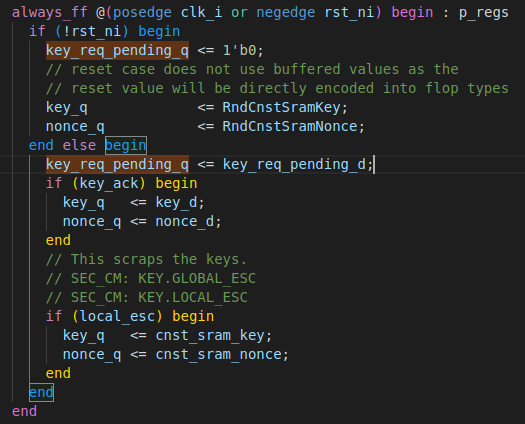

## Bug 2: Persistent SRAM Data
This bug is meant to represent CWE-1272 but is a fairly loose interpretation. Depending on the boot and power-up/down instructions, the program flow and what must be cleared will change so it is difficult to identify sensitive assets without knowledege of the programs. Instead, a generic concern might be the clearing of memory that will at some point hold sensitive data, such as the SRAM. In the OpenTitan SoC, the data in the SRAM is scrambled and the data effectively becomes "invalid" when the scrambling key is renewed (the data cannot be unscrambled). Once the key is renewed, an initialization can also be requested to write the SRAM with pseudo-random data. This functionality is crucial to confidentiality of the SRAM data, as these operations are often done in and out of state transitions. A section of the implementation in OpenTitan is shown in Fig 1. This code snippet was taken from `sram_ctrl`, the SRAM Controller. This controller is the interface between the rest of the system and any SRAM memory. The `always_ff @ (posedge clk) or negedge rst_ni` block signify that the signals inside are registers. The `key_req_pending_q` gets asserted when a request for a new key is issued and `key_ack` gets asserted when the new key has been provisioned, which subsequently updates the key and nonce. On reset, `key_req_pending_q` is cleared and the key and nonce are set to constants defined by parameters. If a new key is never requested, the constant key will persist. A simple but meaningful modification is to modify the assignment to `key_req_pending`. For example, completely removing the assignment, as shown in Fig. 2, will make it stay at 0. We can also extend this by adding a bug to the initialization function so that the data cannot be cleared. This is shown in Fig. 3. Together, these ensure that previous data always be unscrambled, and that sensitive information cannot be wiped.

    
Figure 1: Original SRAM Key Request

Figure 2: Buggy SRAM Key Request

   
Figure 3: Buggy SRAM Initialization Request