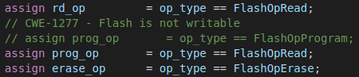

## Bug 3: Unwritable Flash Memory
A potential introduction of CWE 1277 into a design is through the inability to write to Flash memory. If we assume that there are no defects in the memory itself, any denial of service would originate from the Flash controller. The flash controller of the OpenTitan SoC is seperated into two "entities". The Flash Protocol Controller interacts with software and other hardware components while the Flash Protocol Controller is responsible for interacting with the memory itself. I focused on the protocol controller since all writes are issued from it. Fig. 1 illustrates the original design, and the modification. Initially, `prog_op` is asserted if the incoming operation is a flash program (write) request. The buggy behaviour now incorrectly compares it to a read operation, `FlashOpRead`. This has two effects: (i) the flash controller cannot issue a write when desired, and (ii) there will be contention between the `rd_op` and `prog_op` when a read is desired. For this bug, we are concerned with the first effect.

          
Figure 1: Flash Write Operation Bug