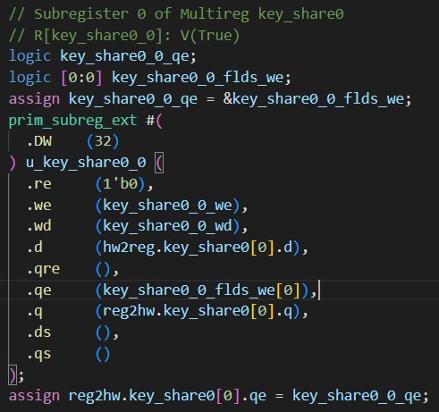

## Bug 4: Software-Readable Key Register
This bug is meant to demonstrate that a seemingly CWE (CWE-1276) and "simple" bug can have irreparable consequences. As discussed above, module instantions are crucial to the secure behavior of hardware. Most times, incorrectly connected child modules will have noticeable functional impact that will alert of an issue during verification. On the security side however, it may go undetected unless the security feature which depends on the incorrectly connected port(s) are tested. In the OpenTitan SoC, every memory-mapped register is created as a module instantiation, as shown in Fig. 1. This specific register is meant to hold part of the AES key. As we can see, `.re` is "hard-coded" to `1'b0`, signifying that is it a write-only register that cannot be read by software. This is crucial to the confidentiality of the system as malicious software could attempt to read the key and leak it. It follows that inverting that bit will make it always readable. This is shown in Fig 2. If this is repeated for every key register, the whole key can be stealthily leaked by software. 

   
Figure 1: Memory-mapped register for AES Key

   
Figure 2: Buggy Memory-mapped register for AES Key